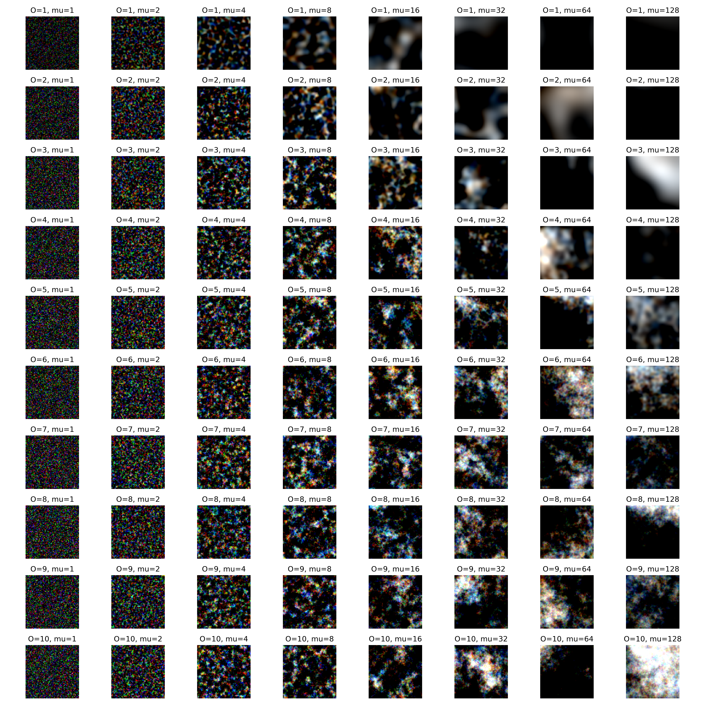
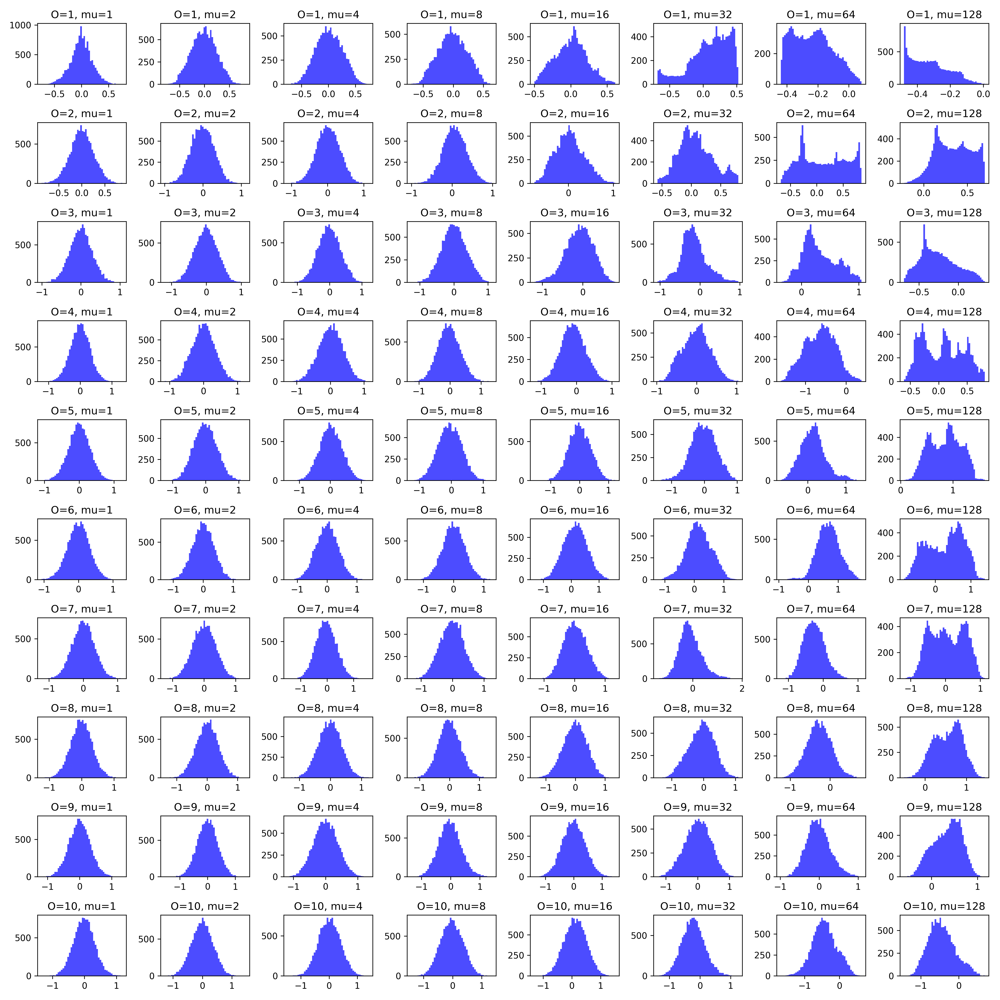
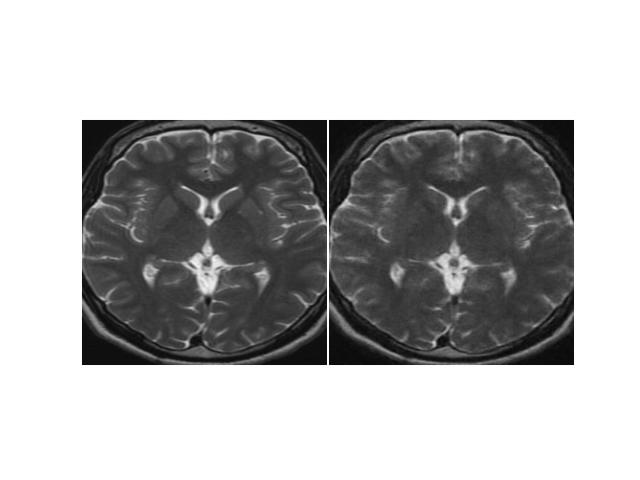

---

# Annotsim: Self-Supervised Anomaly Segmentation via Diffusion Models with Dynamic Transformer UNet (WACV 2024) 📈
This research paper introduces a novel self-supervised anomaly detection method for image segmentation. It employs a diffusion model utilising a newly developed four-dimensional simplex noise function (Tsimplex) for improved efficiency and sample quality, especially in higher-dimensional and coloured images. The core of the model is a Dynamic Transformer UNet (DTUNet), a modified Vision Transformer architecture designed to handle time and noise image patches as tokens. Extensive experiments across three datasets demonstrate significant performance improvements over existing generative-based anomaly detection methods, particularly in medical imaging. The source code is publicly available.

## Features

- **Custom Diffusion Models**: An extended UNet with selective denoising capabilities.
- **Dynamic Transformer Blocks**: Enhancements for dynamic anomaly segmentation.
- **Simplex Noise Integration**: Supports 3D/4D noise generation for improved feature diversity.
- **Comprehensive Evaluation Metrics**: Tools to calculate precision, recall, Dice score, and more.
- **Visualization Tools**: Generates diffusion videos and detection outputs for interpretability.

---

## Example Outputs

### Diffusion Training Visualization
 


 

### Anomaly Detection Results


### Simplex Noise Example


---

## Project Structure

```plaintext
Annotsim/
├── src/
│   ├── models/               # Model architectures (UNet, transformer blocks, etc.)
│   ├── utils/                # Helper functions (dataset loading, noise generation, etc.)
│   ├── scripts/              # Training and evaluation scripts
├── requirements.txt          # Python dependencies
├── setup.py                  # Installation script
├── README.md                 # Project documentation
└── .gitignore                # Ignored files and directories
```

---

## Installation

### Prerequisites
- Python 3.8 or later
- CUDA-enabled GPU (optional but recommended for training)

### Steps

1. Clone the repository:
   ```bash
   git clone https://github.com/MAXNORM8650/Annotsim.git
   cd Annotsim
   ```

2. Install dependencies:
   ```bash
   pip install -r requirements.txt
   ```

3. Install the repository as a package:
   ```bash
   pip install -e .
   ```

---

## Usage

### Train a Diffusion Model
To train a diffusion model:
```bash
python src/scripts/diffusion_training_UVW.py --argN
```
Replace `argN` with your desired configuration file from "test_args" file.

### Evaluate a Model
To evaluate a model:
```bash
python src/scripts/detection.py --argN
```

---

## Datasets

This project uses two publicly available datasets:
1. **BRATS2021**: A dataset for brain tumor segmentation.
2. **Pneumonia X-Ray**: A dataset for chest X-ray anomaly detection.

For more details, refer to the datasets' official documentation.

---

## Results

### Diffusion Videos
Generated videos during training and evaluation are saved in:
```plaintext
outputs/diffusion-videos/
```

### Detection Outputs
Detection results are saved in:
```plaintext
outputs/detection-images/
```

---

## Citation

If you use this work in your research, please cite the following paper:
```bibtex
@inproceedings{kumar2023self,
  title={Self-supervised Diffusion Model for Anomaly Segmentation in Medical Imaging},
  author={Kumar, Komal and Chakraborty, Snehashis and Roy, Sudipta},
  booktitle={International Conference on Pattern Recognition and Machine Intelligence},
  pages={359--368},
  year={2023},
  organization={Springer}
}
```

---

## Contributors

- **Komal Kumar**: [GitHub Profile](https://github.com/MAXNORM8650)

The project imported from:
- [AnoDDPM](https://github.com/Julian-Wyatt/AnoDDPM)
- [Predictive Convolutional Attentive Block](https://github.com/ristea/sspcab)
- [Guided Diffusion](https://github.com/openai/guided-diffusion)
---

---

## License


---

