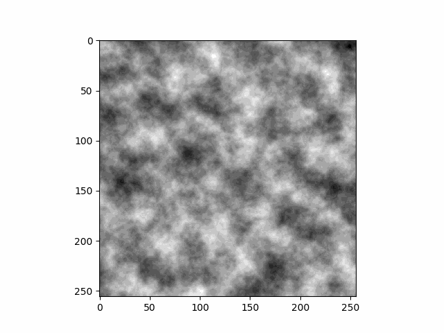

# Annotsim: Self-Supervised Anomaly Segmentation via Diffusion Models with Dynamic Transformer UNet (WACV 2024) 🚀

This repository provides code and resources for the research paper *"Self-Supervised Anomaly Segmentation via Diffusion Models with Dynamic Transformer UNet"*. The approach introduces a novel self-supervised anomaly detection method for image segmentation, employing a diffusion model enhanced by a newly developed four-dimensional simplex noise function (**Tsimplex**) and a **Dynamic Transformer UNet (DTUNet)**. The model is particularly effective for higher-dimensional and colored medical imaging tasks, outperforming existing generative-based methods.

---

## Key Features

- **Custom Diffusion Models**: Extended UNet architecture with selective denoising capabilities.
- **Dynamic Transformer Blocks**: Modified Vision Transformer (ViT) building blocks for dynamic segmentation tasks.
- **Enhanced Simplex Noise**: Integration of 3D/4D simplex noise for improved feature diversity and sample quality.
- **Comprehensive Evaluation Metrics**: Precision, recall, Dice score, and more for thorough model assessment.
- **Visualization Tools**: Diffusion videos and detection outputs enable interpretability and qualitative analysis.

---

## Example Outputs

### Diffusion Training Visualization
  
  
  
  
  

### Anomaly Detection Results

### Simplex Noise Example

---

## Project Structure

Annotsim/
├── src/
│   ├── models/               # Model architectures (UNet, Transformer blocks, etc.)
│   ├── utils/                # Helper functions (dataset loading, noise generation, etc.)
│   ├── scripts/              # Training and evaluation scripts
├── assets/                   # Visualization assets and intermediate results
├── requirements.txt          # Python dependencies
├── setup.py                  # Installation script
├── README.md                 # Project documentation
└── .gitignore                # Ignored files and directories

Installation

Prerequisites
	•	Python 3.8+
	•	CUDA-enabled GPU (recommended for training)

Steps
	1.	Clone the repository:

git clone https://github.com/MAXNORM8650/Annotsim.git
cd Annotsim

	2.	Optional: Create a virtual environment:

python -m venv venv
source venv/bin/activate  # For Windows: venv\Scripts\activate

	3.	Install dependencies:

pip install -r requirements.txt

	4.	Install as a package:

pip install -e .

Usage

Training a Diffusion Model

Use a configuration file from test_args:

python src/scripts/diffusion_training_UVW.py --config path/to/config.yaml

Evaluating a Model

Evaluate the model on a dataset:

python src/scripts/detection.py --config path/to/config.yaml

Datasets

This project supports multiple datasets, including:
	•	BRATS2021: Brain tumor segmentation dataset.
	•	Pneumonia X-Ray: Chest X-ray anomaly detection dataset.

Refer to their official documentation for more details:
	•	BRATS2021
	•	Pneumonia X-Ray

Results
	•	Diffusion Videos: Saved in outputs/diffusion-videos/
	•	Detection Outputs: Saved in outputs/detection-images/

Citation

If you find this work helpful, please cite:

@inproceedings{kumar2024annotsim,
  title={Self-Supervised Anomaly Segmentation via Diffusion Models with Dynamic Transformer UNet},
  author={Kumar, Komal and Chakraborty, Snehashis and Roy, Sudipta},
  booktitle={Proceedings of the IEEE/CVF Winter Conference on Applications of Computer Vision (WACV)},
  pages={XXXX--XXXX},
  year={2024},
  organization={IEEE}
}

Contributors
	•	Komal Kumar: GitHub Profile

This project builds upon and integrates work from:
	•	AnoDDPM
	•	Predictive Convolutional Attentive Block
	•	Guided Diffusion

License

This project is licensed under the MIT License.

Roadmap
	•	Further dataset integrations
	•	Enhanced visualization and interpretability tools
	•	Real-time anomaly detection support

FAQ

Q1: Why use DTUNet over a traditional UNet?
A: DTUNet’s integration of dynamic transformer blocks enables it to effectively handle temporal and noise-based image representations, improving anomaly segmentation performance in complex medical imaging scenarios.

Q2: How do I customize the simplex noise function?
A: Adjust parameters in utils/noise_generation.py as per the documentation for tailored noise generation strategies.

Contact

For inquiries or collaboration opportunities:
	•	Komal Kumar: komal.kumar@example.com

We welcome contributions and suggestions! Please open an issue or submit a pull request to get involved.

